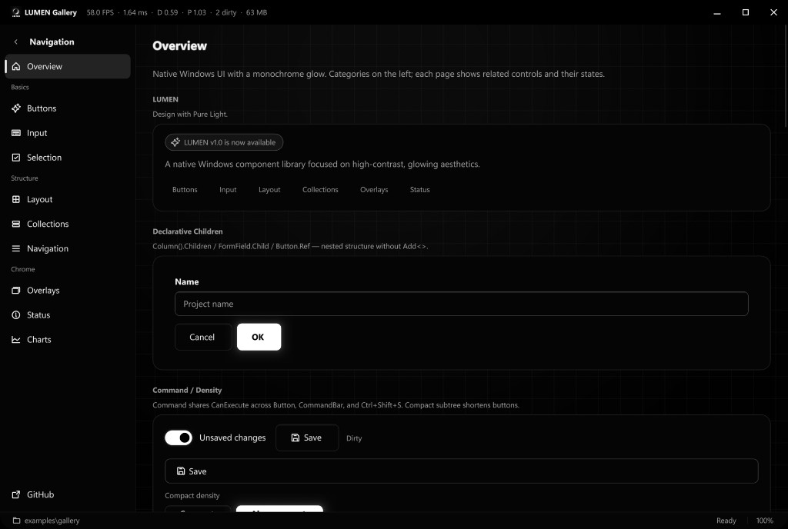
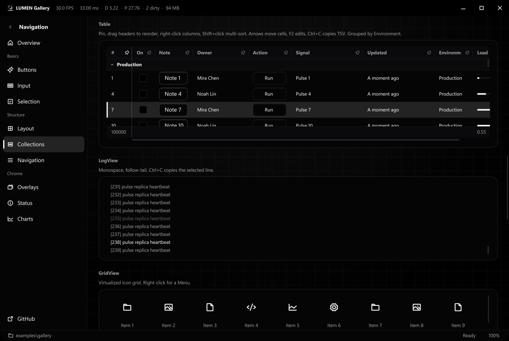
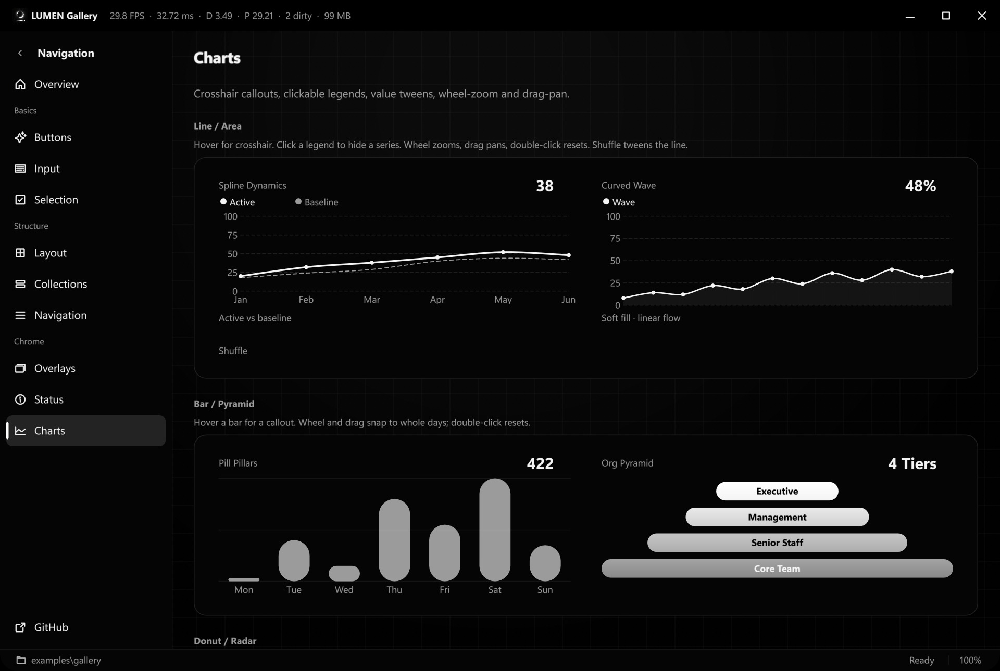

# LUMEN

<p align="center">
  Windows 原生 · 纯黑单色 · 光感 UI<br>
  <sub>C++20 · Win32 / D3D11 / D2D / DirectComposition · Windows 10 1903+ / 11 · MIT</sub>
</p>

<p align="center">
  
  
  
</p>

纯黑底上用亮度阶梯与字形建立层次：外发光、鼠标跟随聚光卡、顶部镜面高光、暗网格与环境辉光。光感 token（`glow_sm/md/lg`、`spotlight_fill/border`、`specular_line`、`ambient_flare`）一律受 `Window::GlowIntensity(0..1)` 缩放。无第三方依赖；文字可选 LumaText 栅格化。

- **几行出界面**：控件是带属性与回调的对象；`Row` / `Column` / `Grid` / `Grow` / `ScrollViewer` 排版。
- **按需链接**：一控件一编译单元，`/OPT:REF` 只留下用到的。
- **当帧跟手**：`Spotlight(true)` 光斑随鼠标；进出只平滑透明度。
- **高 DPI**：Per-Monitor V2，布局以 DIP 计。
- **快**：1280×800 全帧（按钮 + 10 万行虚拟列表 + 聚光卡 + 图）约 **4.8 ms**，预算 &lt; 8 ms。空闲零 CPU。

## 试用

无需编译。从 [Releases](https://github.com/jimmgreen/LUMENUI/releases/latest) 取：

| 包 | 给谁 |
| --- | --- |
| [`lumen-gallery-windows-x64.zip`](https://github.com/jimmgreen/LUMENUI/releases/latest) | 解压即运行 Gallery。已带 `lumatext.dll` 与 VC 运行库 |
| [`lumen-sdk-windows-x64.zip`](https://github.com/jimmgreen/LUMENUI/releases/latest) | `lumen.lib` + 头文件 + `lumatext.dll`，`find_package(lumen CONFIG)` |

Windows 10 1903+ / 11，x64。Gallery 若被 SmartScreen 拦住，选「仍要运行」。

## 接入

源码构建需要 MSVC 2022+、CMake 3.25+、Ninja：

```bat
build.bat
```

产物在 `build\`：`lumen.lib`、`lumen_gallery.exe`、各测试 exe。

自己的工程只记 `lumen_add_executable`（WIN32、链 `lumen::lumen` / `lumen::main`、拷 DLL、`/utf-8`）：

```cmake
# 子目录
add_subdirectory(path/to/LUMENUI)
lumen_add_executable(myapp main.cpp app.rc)

# FetchContent
include(FetchContent)
FetchContent_Declare(lumen
    GIT_REPOSITORY https://github.com/jimmgreen/LUMENUI.git
    GIT_TAG v0.1.0)
FetchContent_MakeAvailable(lumen)
lumen_add_executable(myapp main.cpp app.rc)

# 预编译 SDK
set(lumen_DIR "C:/libs/lumen-sdk-windows-x64/lib/cmake/lumen")
find_package(lumen CONFIG REQUIRED)
lumen_add_executable(myapp main.cpp app.rc)
```

起步模板：`examples/template/`（`cmake -S . -B build`，带图标）。vcpkg overlay：`ports/lumen/`。非 CMake 工程 `#include <lumen/wmain.h>` 后写 `LUMEN_MAIN()`，不要再链 `lumen::main`。

LumaText 缺失时 configure 会 `WARNING`，运行回退 DirectWrite；强制失败加 `-DLUMEN_REQUIRE_LUMATEXT=ON`。

产品代码按需 include 单个控件头。三套最小集：

| 场景 | 头 |
| --- | --- |
| 窗口壳 | `App.h` `Window.h` `NavigationView.h` `PageHost.h` `ScrollViewer.h` |
| 表单 | `FormField.h` `TextBox.h` `ComboBox.h` `Button.h` `Dialog.h` |
| 列表 | `ListView.h` `Table.h` `ItemsModel.h` |

`lumen/lumen.h` 拉齐全部头，适合 Gallery 与演示。UTF-8 用 `lumen::U8("你好")`。

## 开始

```cpp
#include <lumen/lumen.h>
#include <lumen/Main.h>
int lumen_main(std::span<const std::wstring_view>) {
    return lumen::Run(L"演示", [](lumen::Window& w) {
        w.Root().Add<lumen::Button>(L"你好", lumen::ButtonKind::Primary);
    });
}
```

`Column` 交叉轴默认 Stretch；`Grow` 吃主轴剩余；超出视口用 `ScrollViewer().Grow()`。不要手写 `SetBounds`。

```cpp
auto& cols = window.Root().Add<lumen::Grid>(2).Gap(16.0f);
auto& left = cols.Add<lumen::Column>().Spacing(12.0f);
left.Add<lumen::TextBox>().Placeholder(L"搜索");
left.Add<lumen::ListView>().Grow();
```

`Grid(1, 0, 1)` 是 1fr / auto / 1fr。间距：`Column().Comfortable()` / `Dense()`。父级 `AlignCross(Start)` 时子级用 `FillCross()` 铺宽。

```cpp
Property<std::wstring> name;
auto& sheet = window.Root().Add<Form>();
sheet.Field(L"名称").Validate(validate::Required()).Add<TextBox>().BindText(name);
sheet.Add<Button>(L"提交", ButtonKind::Primary).BindEnabled(sheet.Valid());
window.Confirm(L"删除", L"不可恢复", [](bool yes) { (void)yes; });
```

```cpp
window.Root().Children(
    lumen::Column().Comfortable().Children(
        lumen::FormField(L"名称").Child(lumen::TextBox().Placeholder(L"项目名")),
        lumen::Row().Children(
            lumen::Button(L"取消"),
            lumen::Button(L"确定", lumen::ButtonKind::Primary).Ref(ok))
    )
);

save.CanExecute([&] { return dirty; });
ok->Bind(save);
window.Bind(save);
toolbar.Add(save);

auto& compact = window.Root().Add<lumen::Column>();
compact.Density(lumen::Density::Compact);
```

```cpp
window.Post([&window] { window.ShowToast(L"imported"); });
window.BindShortcut(L"Ctrl+S", [&window] { /* save */ });
if (auto path = lumen::dialogs::PickFile(window, L"文本|*.txt|全部|*.*")) {
    lumen::clipboard::Text(*path);
}
window.ShowBusy(L"正在导入…", [&window] { window.CloseBusy(); });
window.SetInterval(30.0f, [&window] { /* 自动保存 */ });
window.RememberPlacement(L"Software\\MyApp\\Main");
```

`App::SingleInstance(L"MyApp")` 已有实例则激活主窗并返回 false。托盘：`TrayIcon` / `MinimizeToTray` / `TrayMenu`。系统热键：`App::RegisterGlobalHotkey`。

```cpp
auto& form = window.Root().Add<lumen::Column>().Comfortable();
form.Add<lumen::FormField>(L"名称").Add<lumen::TextBox>().Placeholder(L"项目名");
form.Add<lumen::Button>(L"删除", lumen::ButtonKind::Danger, [&window] {
    window.ShowDialog({
        .title = L"删除",
        .message = L"不可恢复",
        .primary = {L"删除", [] {}},
        .secondary = {L"取消", {}},
    });
});
form.Add<lumen::ListView>()
    .ItemCount(100)
    .ItemText([](size_t i, std::wstring& s) { s = L"Item " + std::to_wstring(i); })
    .Grow();
form.Add<lumen::ListView>().Bind(inbox).Grow();
inbox.Reset({L"Standup", L"Review"});
inbox.Insert(0, L"New");
inbox.RemoveAt(0);
```

`FilteredModel` / `SortedModel` 装饰源模型；`Table::Bind` 读 `ItemRow.text` / `cells`。模型须活过控件。

常用一行：`ShowToast` / `Confirm` / `RunAsync(..., busy)` / `BindShortcut` / `Persist` / `Bind(model)` / `Command` / `ShowDialog(spec)` / `RememberPlacement` / `SingleInstance`。

完整界面见 `examples/gallery/`。

## 控件

链式 setter 返回自身；`ToolTip` / `Enabled` / `Grow` 可插在链中任意位置。菜单 `PopupTo(control)`，分割/下拉按钮 `DropdownMenu(std::move(menu))`。

### 按钮

| 控件 | 说明 |
| --- | --- |
| `Button` | Radiant / Electric Edge / Glass / Halo / 白热警示；`Shimmer(true)` 流光边框 |
| `RepeatButton` | 按住连发（0.40s / 0.05s） |
| `ToggleButton` | 按下保持 |
| `SplitButton` / `DropDownButton` | 主操作 + 菜单；后者整钮弹出 |
| `HyperlinkButton` | 链接样式 |

### 输入

| 控件 | 说明 |
| --- | --- |
| `TextBox` | 单行/多行、选区、剪贴板、撤销重做 |
| `PasswordBox` | 掩码；`Revealable(true)` 明文开关 |
| `HotkeyBox` | 捕获快捷键 |
| `NumberBox` | 过滤、步进、钳制、spin |
| `AutoSuggestBox` | 建议输入 |
| `ComboBox` | 虚拟化下拉、分组、多选 Chip、Editable |
| `DatePicker` / `TimePicker` | `std::chrono`，系统区域格式 |
| `CalendarView` | 月历 |
| `ColorPicker` | 单色亮度盘 |
| `TokenBox` | Enter / 逗号提交标签 |
| `Slider` / `RangeSlider` | 单值 / 双拇指 |
| `Form` / `FormField` | 标签、必填、`Validate` |

### 选择

| 控件 | 说明 |
| --- | --- |
| `CheckBox` / `RadioButton` / `Switch` | 勾选、互斥、开关 |
| `Segmented` | 分段 |
| `Rating` | 单色星级 |

### 布局

| 控件 | 说明 |
| --- | --- |
| `Row` / `Column` / `Grid` / `WrapPanel` / `ZStack` / `Spacer` | `Grow` 吃主轴剩余 |
| `StackPanel` / `Panel` | `CardStyle::Lumen` 聚光卡 |
| `ScrollViewer` | 裁切、覆盖滚动条 |
| `SplitView` / `Splitter` | 侧栏 / 拖拽分栏 |
| `Viewbox` | 按自然尺寸再缩放 |
| `SettingsCard` / `Expander` / `GroupBox` | 聚光卡与分组 |

### 集合

| 控件 | 说明 |
| --- | --- |
| `ListView` | 虚拟化、多选、`Bind(ItemsModel)` |
| `GridView` | 虚拟化图标网格 |
| `Table` | 拖列宽、排序、行内编辑、`Column(title, &T::mem)` |
| `LogView` | 等宽、贴底、Ctrl+C |
| `TreeView` / `TreeTable` | 虚拟化树 |
| `TabControl` / `Pagination` / `Carousel` | 标签、分页、轮播 |

`Table::SelectedIndex()` 是视图行；数据行用 `SelectedDataIndex()`。

### 导航

| 控件 | 说明 |
| --- | --- |
| `NavigationView` / `PageHost` | Auto / Expanded / Compact |
| `Breadcrumb` | 面包屑 |
| `Menu` / `MenuBar` | 子菜单、滚动、快捷键 |
| `CommandBar` | 自动溢出 |
| `Stepper` | 步骤条 |

### 浮层

| 控件 | 说明 |
| --- | --- |
| `Dialog` | 亚克力遮罩 + 外发光 |
| `Flyout` / `TeachingTip` / `ToolTip` | 锚定弹层 |
| `Toast` | `Window::ShowToast` |
| `Drawer` | 贴边抽屉 |
| `BusyOverlay` | `Window::ShowBusy` |

### 展示

| 控件 | 说明 |
| --- | --- |
| `Label` / `RichLabel` | 辉光；加粗/链接混排 |
| `ProgressBar` / `ProgressRing` | 确定 / 不定态 |
| `Sparkline` / `Gauge` / `Chart` | 迷你图、仪表、多图种 |
| `Badge` / `Chip` / `InfoBadge` | 标签与角标 |
| `InfoBar` | 通知条 |
| `Skeleton` / `Avatar` / `EmptyState` | 加载、头像、空状态 |
| `ImageView` / `IconView` | 位图 / 路径图标 |
| `Separator` / `ColorSwatch` | 分割线、光效档位 |
| `TitleBar` / `StatusBar` | 客户区标题栏、底栏 |
| `FileDropZone` | 拖入文件 |

## 图标

Phosphor Regular，约 90 个内置字形（`icon::kSettings` / `kEdit` / `kDownload`），默认 16px / weight 1.5。未注册码点回退 Segoe Fluent / MDL2。

```cpp
painter.DrawIcon(lumen::icon::kSearch, slot, theme.text);
painter.DrawIcon(lumen::icon::kZap, center, theme.text, 20.0f);
painter.DrawIconPath(kSvgD, slot, theme.text);
lumen::icon::Register(L'\uF000'[0], kSvgD);
```

## 实现

```
include/lumen/     公共 API
src/core/          渲染、文本、窗口、输入、动画、布局
src/controls/      一控件一 .cpp
examples/gallery/  展示程序
tests/             视觉 / 性能 / 动画 / API
```

呈现：D3D11 → DXGI 组合交换链（FLIP_SEQUENTIAL、预乘 alpha）→ DirectComposition；脏区 `Present1`。文字走 LumaText（`LUMEN_LUMATEXT` 可指定 DLL），失败回退 DirectWrite。动画跟 `Present(1,0)` 垂直同步，有动画才跑；光斑位置不走时钟。

## 测试

```bat
build\lumen_visual_test.exe   # 暗色 PNG + 像素断言
build\lumen_perf_test.exe     # 帧耗时，预算 < 8 ms
build\lumen_anim_test.exe     # 缓动 / 补间 / 弹簧
build\lumen_api_test.exe      # 链式 setter + README 代码块
```

## 排障

- `LUMEN_LOG=C:\temp\lumen.log` 或 `SetLogSink`。Warn/Error 默认也会 `OutputDebugString`。
- `D3D11 device is WARP`：无硬件 GPU。`empty root`：`Show` 前没 `Add`。`LumaText unavailable`：字比 Gallery 糙。
- 高 DPI 发糊：`Window` 会 `App::Ensure()` 设 PMv2；进程 manifest 覆盖时 Debug 下 `DebugTrap`。
- `Confirm` / `Prompt` 走回调，不要在 UI 线程阻塞等待。
- Gallery 按 F12：`Window::DumpTree`。
